# Azure Hybrid Identity & Security Monitoring Lab

A self-directed Azure security lab that builds a domain controller, syncs on-premises identities into Microsoft Entra ID, enforces Conditional Access, and validates detections with Microsoft Sentinel and KQL.

**Completed:** June 29, 2026 · **Environment:** Azure for Students + Microsoft 365 E5 Developer Tenant · **Approach:** No guided walkthrough

---

## Overview

This lab demonstrates practical Azure security administration across infrastructure, identity, access control, monitoring, detection engineering, and incident response. The environment was built from scratch, including Azure networking, a Windows Server domain controller, Microsoft Entra Connect synchronization, Conditional Access policies, Sentinel connectors, and intentional misconfiguration testing.

[Azure Foundation](#phase-1---azure-foundation) · [Domain Controller](#phase-2---domain-controller-deployment) · [Hybrid Identity](#phase-3---hybrid-identity-with-entra-connect) · [Conditional Access](#phase-4---conditional-access-policies) · [Detection](#phase-5---detection-stack) · [Incidents](#incident-reports) · [KQL](#kql-query-reference)

### Phase Status

| Phase | Status | Notes |
|---|---|---|
| Phase 1 - Azure Foundation | ✅ Complete | Resource group, VNet, and budget alert |
| Phase 2 - Domain Controller | ✅ Complete | Windows Server 2025, lab.local domain, OUs, and test users |
| Phase 3 - Entra ID Sync | ✅ Complete | Entra Connect, three users synced, on-prem sync verified |
| Phase 4 - Conditional Access | ✅ Complete | Three CA policies built, tested, and verified in sign-in logs |
| Phase 5 - Misconfigurations & Detection | ✅ Complete | Three misconfigurations introduced, queried, documented, and remediated |

---

## Phase 1 - Azure Foundation

**Objective:** Establish a cost-safe Azure environment with networking in place before deploying compute resources.

| Component | Detail |
|---|---|
| Budget Control | Created `lab-budget` with a 50% threshold alert at $5 |
| Network | Created `vnet-security-lab` with address space `10.0.0.0/16` |
| Subnet | Prepared `snet-dc` for the domain controller subnet |

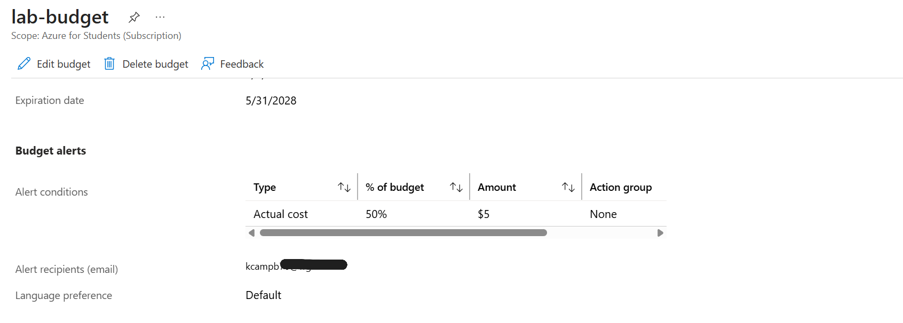
*Budget alert configured for the Azure for Students subscription.*

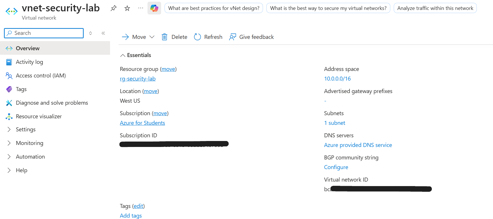
*Virtual network overview showing the lab network address space and subnet.*

| Issue | Resolution |
|---|---|
| East US region blocked by Azure Policy | Moved resources to an allowed region |
| VNet creation denied with policy action error | Matched the region consistently across all resources |

---

## Phase 2 - Domain Controller Deployment

**Objective:** Deploy a Windows Server VM, promote it to a domain controller, build an OU structure, and create test accounts.

| Setting | Value |
|---|---|
| VM Name | `vm-dc02` |
| Operating System | Windows Server 2025 Datacenter x64 Gen2 |
| Size | Standard_D2s_v3, 2 vCPU, 8 GiB memory |
| Domain | `lab.local` |
| Static private IP | `10.0.0.4` |

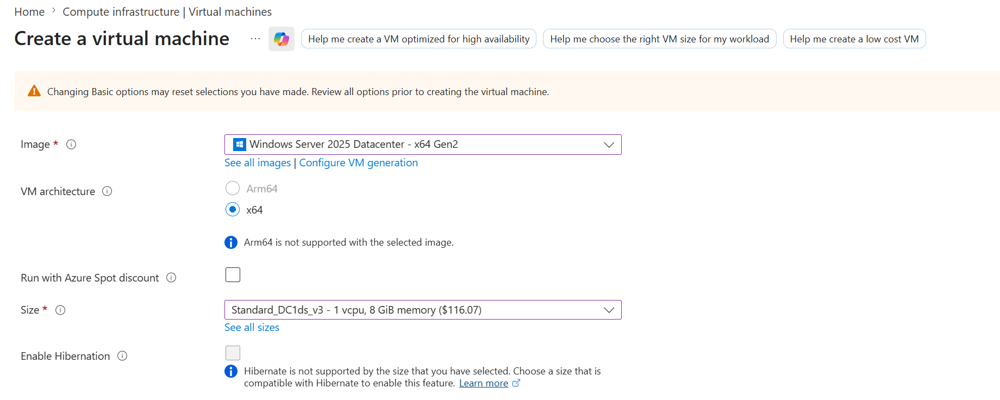
*Windows Server 2025 Datacenter selected for the domain controller VM.*

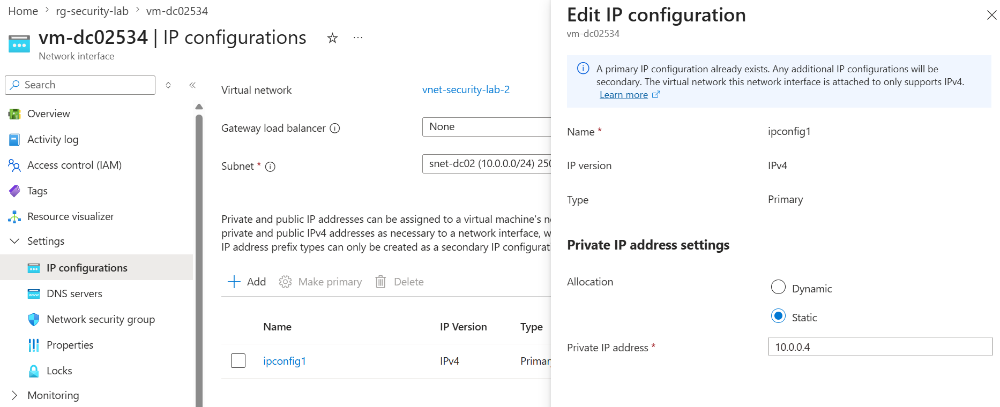
*The domain controller NIC was set to a static private IP address of 10.0.0.4.*

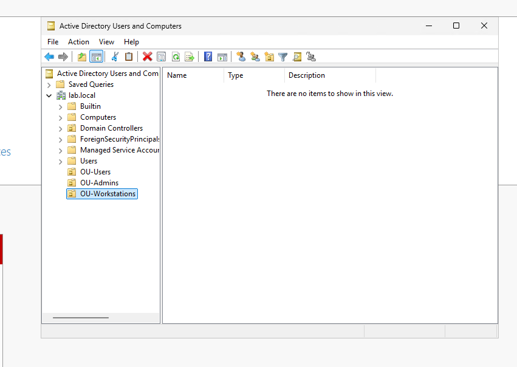
*Active Directory OU structure created for users, admins, and workstations.*

```powershell
Get-ADUser -Filter * | Select Name, SamAccountName, DistinguishedName
```

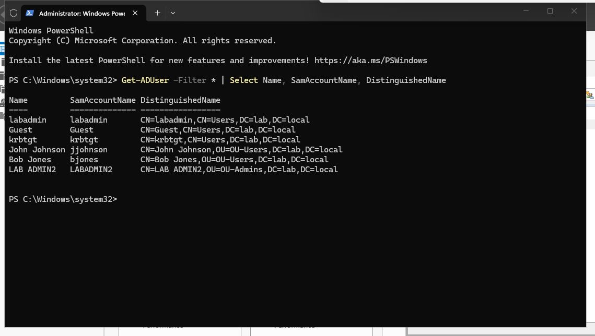
*PowerShell verification showing lab users and their distinguished names.*

| OU | Users |
|---|---|
| OU-Users | `jjohnson`, `bjones` |
| OU-Admins | `LABADMIN2` |
| OU-Workstations | Reserved for future workstation objects |

> A key infrastructure fix was identifying that RDP traffic was blocked by conflicting NSG placement. The allow rule had to exist where traffic was actually filtered.

---

## Phase 3 - Hybrid Identity with Entra Connect

**Objective:** Sync on-premises Active Directory users into the Microsoft 365 E5 developer tenant for cloud identity management and Conditional Access testing.

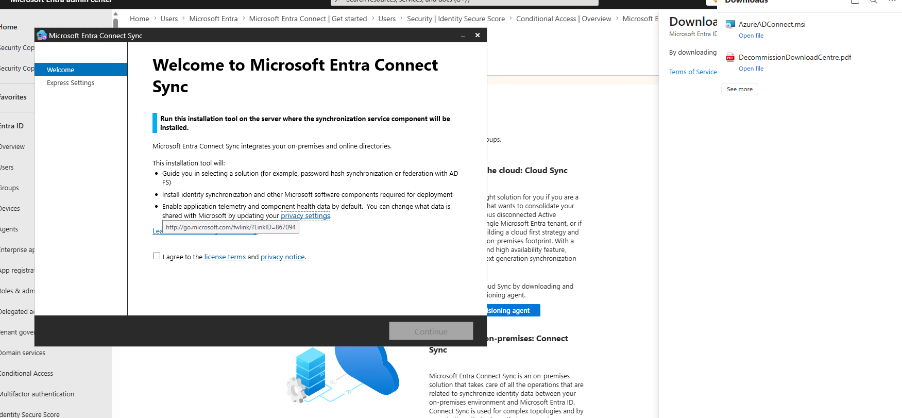
*Microsoft Entra Connect Sync installed on the domain controller.*

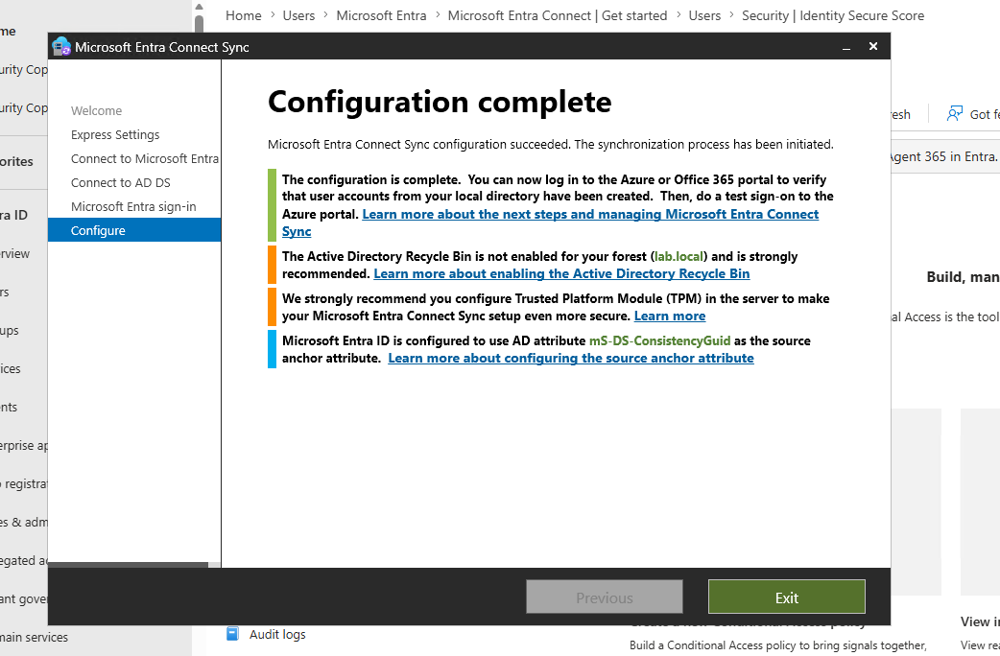
*Entra Connect configuration completed and synchronization initiated.*

### UPN Suffix Fix

AD users initially inherited the non-routable `lab.local` suffix. The tenant suffix was added and user principal names were corrected with PowerShell.

```powershell
Set-ADUser -Identity jjohnson -UserPrincipalName "jjohnson@fk5xg7.onmicrosoft.com"
Set-ADUser -Identity bjones -UserPrincipalName "bjones@fk5xg7.onmicrosoft.com"
Set-ADUser -Identity LABADMIN2 -UserPrincipalName "LABADMIN2@fk5xg7.onmicrosoft.com"

Get-ADUser -Filter * -Properties UserPrincipalName | Select Name, UserPrincipalName
```

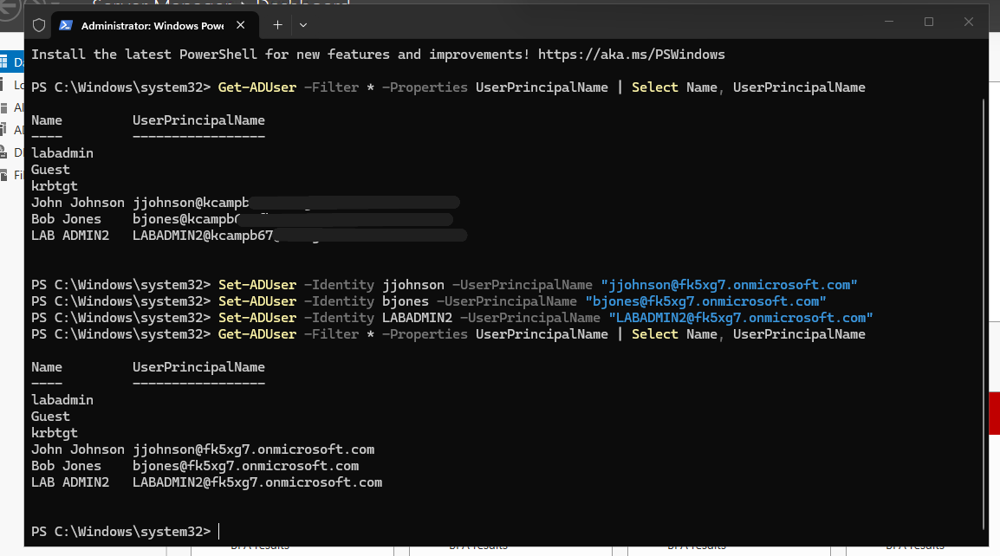
*PowerShell verification showing corrected cloud-routable UPNs.*

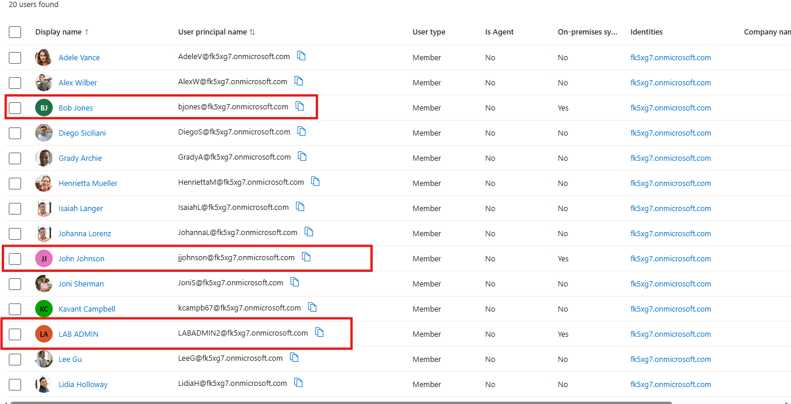
*Synced users visible in Entra ID with on-premises sync enabled.*

| Challenge | Resolution |
|---|---|
| Azure for Students blocked license management | Used the Microsoft 365 Developer Program E5 tenant |
| UPN suffix was malformed through GUI entry | Corrected UPNs with `Set-ADUser` |
| Sync paused after VM deallocation | Restarted ADSync and triggered a delta sync |

---

## Phase 4 - Conditional Access Policies

**Objective:** Implement Zero Trust access controls and verify results through Entra sign-in log analysis.

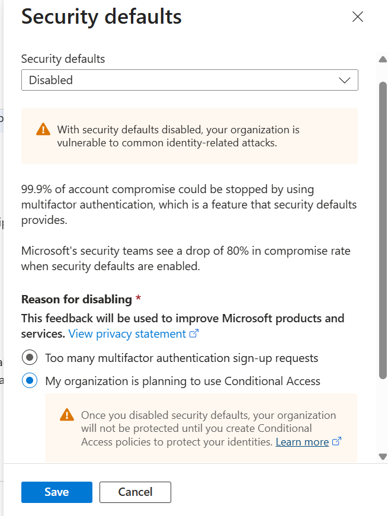
*Security Defaults were disabled because Conditional Access policies were used instead.*

### CA001 - Require MFA for All Users

| | |
|---|---|
| Name | CA001 - Require MFA for All Users |
| Users | All users included |
| Exclusion | Global Administrator role excluded to prevent lockout |
| Target resources | All resources |
| Grant | Require multifactor authentication |
| State | On |

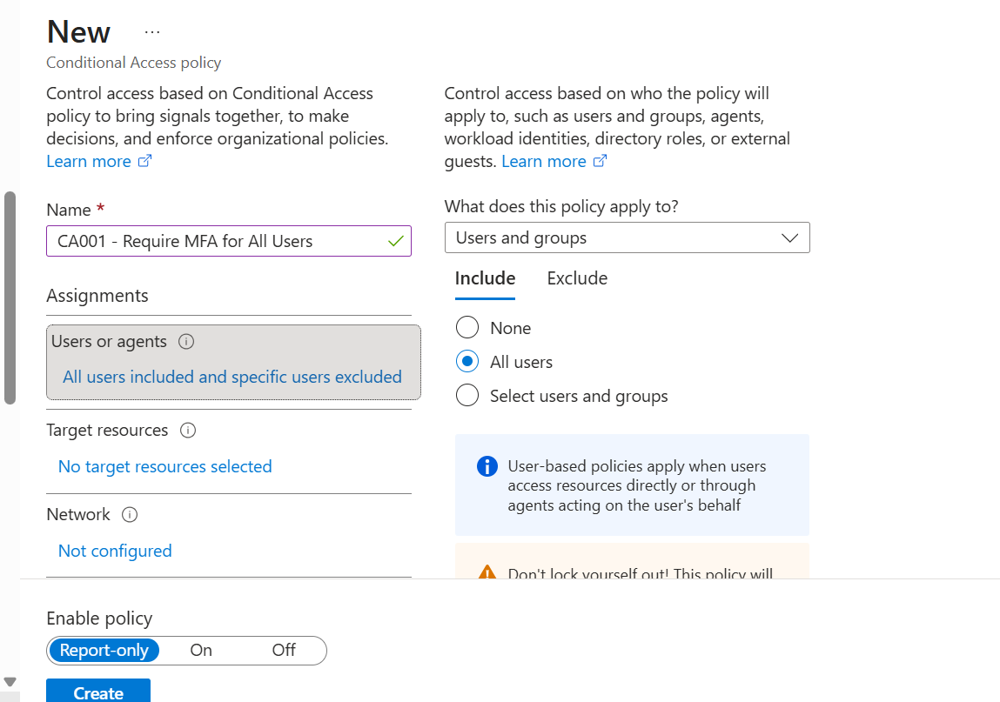
*CA001 included all users while excluding administrator roles for safety.*

### CA002 - Block Legacy Authentication

| | |
|---|---|
| Name | CA002 - Block Legacy Authentication |
| Users | All users |
| Client apps | Exchange ActiveSync and other legacy clients |
| Grant | Block access |
| State | On |

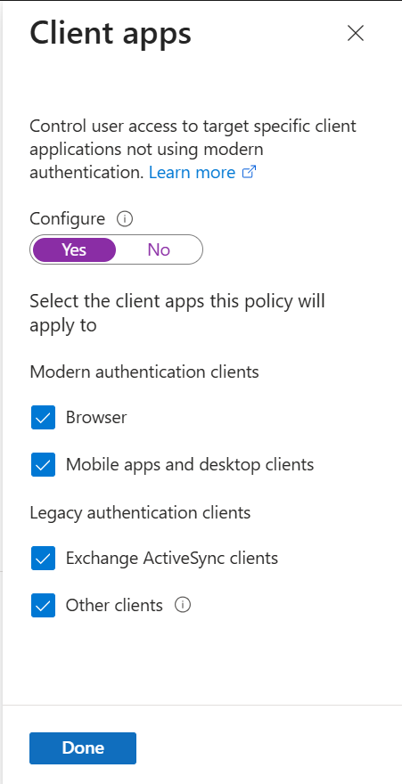
*Legacy authentication clients selected for blocking.*

### CA003 - Block Untrusted Locations

| | |
|---|---|
| Name | CA003 - Block Untrusted Locations |
| Network | Any location included; trusted lab IP excluded |
| Grant | Block access |
| State | On |

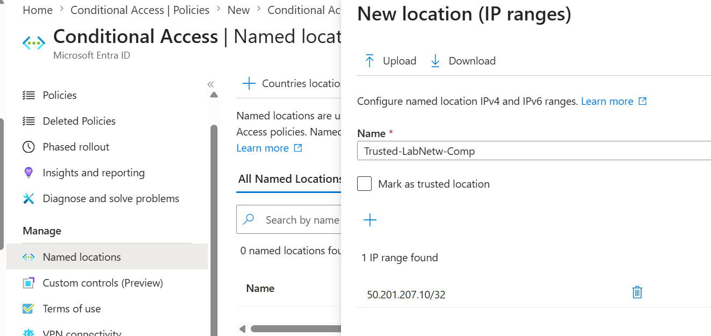
*Trusted lab network named location created with a single IP range.*

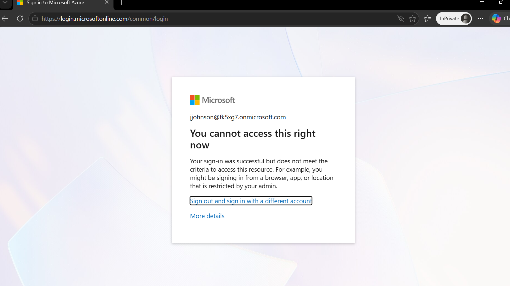
*Test sign-in blocked after Conditional Access policy evaluation.*

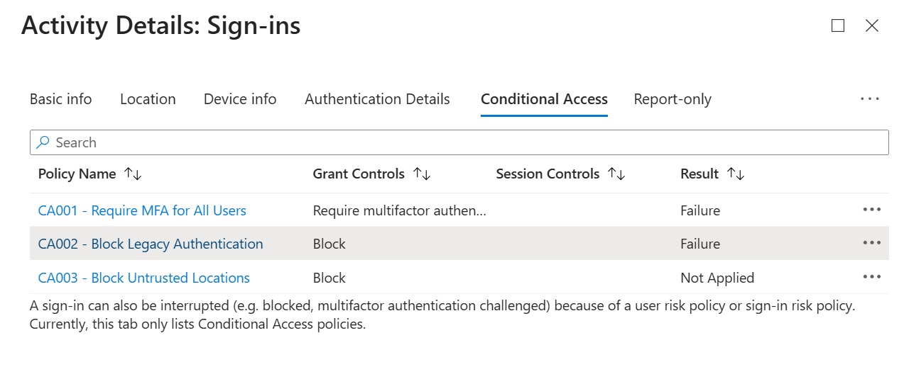
*Sign-in log Conditional Access tab showing policy results.*

---

## Phase 5 - Detection Stack

**Objective:** Connect security logs to Microsoft Sentinel, validate ingestion, and use KQL to investigate intentional misconfigurations.

| Component | Status |
|---|---|
| Microsoft Sentinel | Deployed on `law-security-lab` |
| Microsoft Entra ID Connector | Sign-in logs and audit logs selected |
| Azure Activity Connector | Connected and receiving logs |
| Defender for Cloud | Recommendations reviewed for baseline posture |

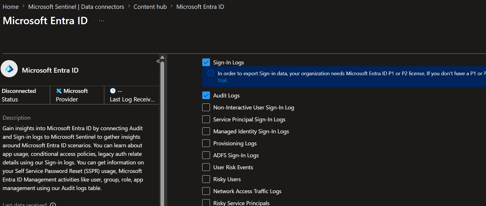
*Microsoft Entra ID connector prepared for sign-in and audit log ingestion.*

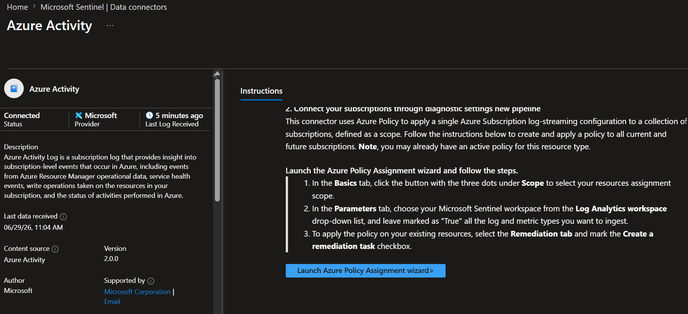
*Azure Activity connector receiving subscription activity logs.*

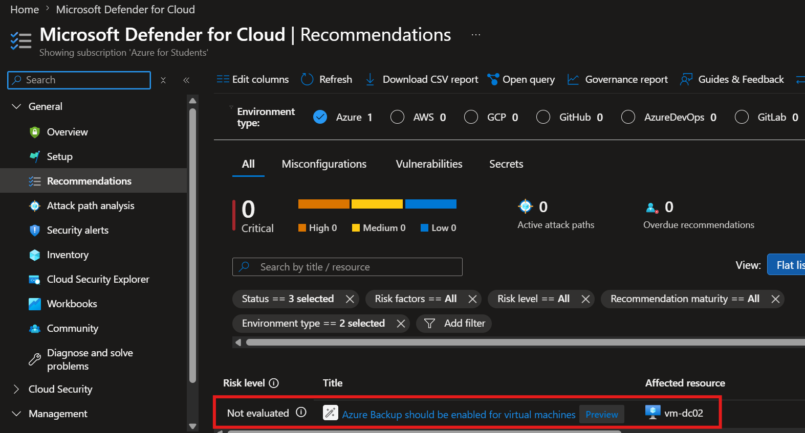
*Defender for Cloud recommendations reviewed for baseline security posture.*

---

## Incident Reports

### Incident 001 - NSG Port Exposure

| | |
|---|---|
| Severity | 🔴 High |
| Affected resource | `vm-dc02-nsg` / `vm-dc02` |
| Finding | An inbound rule allowed `0.0.0.0/0` to all ports and protocols |
| Remediation | Deleted the rule and restored source IP restriction |

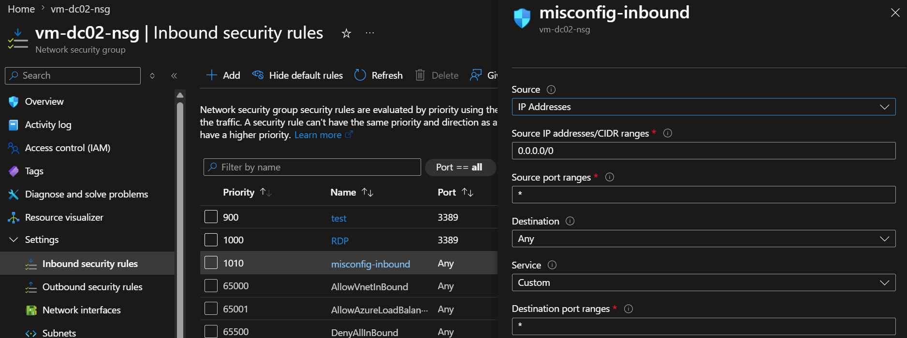
*Intentional inbound NSG misconfiguration created for detection testing.*

### Incident 002 - Storage Account Public Access

| | |
|---|---|
| Severity | 🔴 High |
| Affected resource | `stlabsecurity` |
| Finding | Anonymous blob access was enabled and a public container was created |
| Remediation | Disabled anonymous blob access and removed the public container |

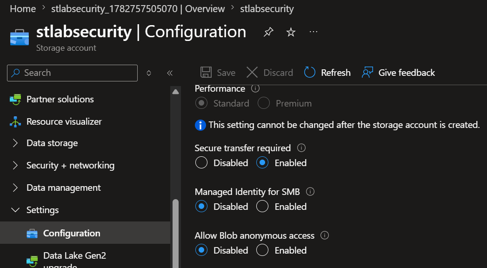
*Storage account setting showing anonymous blob access enabled during the test.*

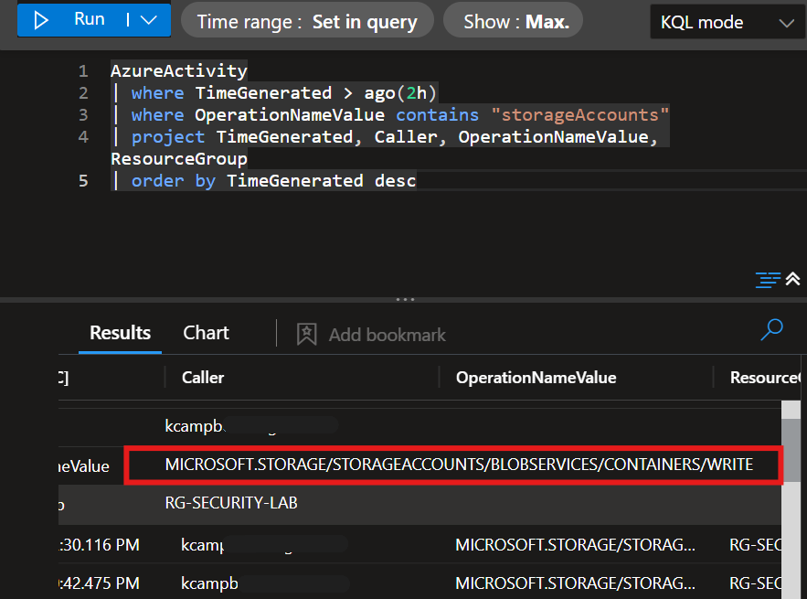
*KQL evidence showing the storage container write operation.*

### Incident 003 - MFA Bypass via Policy Exclusion

| | |
|---|---|
| Severity | 🟡 Medium |
| Affected user | `bjones@fk5xg7.onmicrosoft.com` |
| Finding | Bob Jones was excluded from MFA enforcement, permitting successful sign-in without an MFA challenge |
| Remediation | Removed the exclusion and re-enabled all Conditional Access policies |

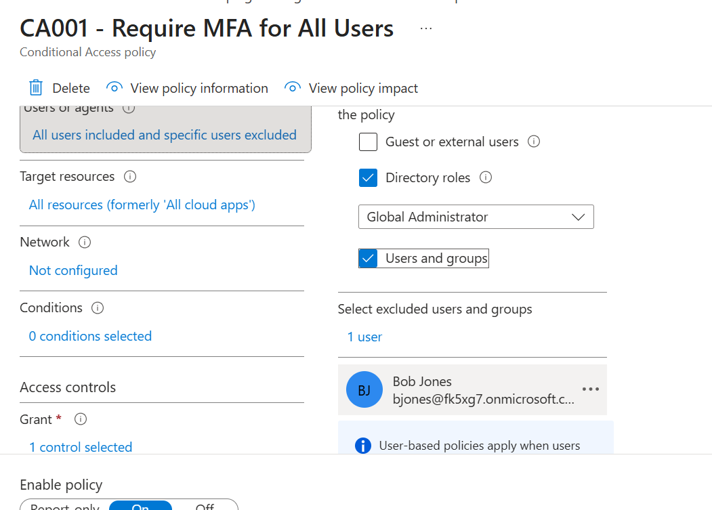
*CA001 policy showing Bob Jones added to the excluded users and groups list.*

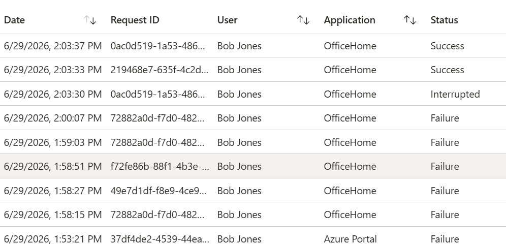
*Bob Jones sign-in log showing failures followed by a successful OfficeHome sign-in.*

---

## KQL Query Reference

### Hunt for NSG Rule Changes

```kql
AzureActivity
| where TimeGenerated > ago(24h)
| where OperationNameValue contains "securityRules"
| project TimeGenerated, Caller, OperationNameValue, ResourceGroup, Properties
| order by TimeGenerated desc
```

### Hunt for Storage Account Changes

```kql
AzureActivity
| where TimeGenerated > ago(24h)
| where OperationNameValue contains "storageAccounts"
| project TimeGenerated, Caller, OperationNameValue, ActivityStatusValue
| order by TimeGenerated desc
```

### Hunt for Sign-ins Without MFA

```kql
SigninLogs
| where TimeGenerated > ago(24h)
| where UserPrincipalName contains "bjones"
| project TimeGenerated, UserPrincipalName, AppDisplayName,
  AuthenticationRequirement, ConditionalAccessStatus
| order by TimeGenerated desc
```

### Verify Log Ingestion Health

```kql
SigninLogs | where TimeGenerated > ago(1h) | take 10
AzureActivity | where TimeGenerated > ago(1h) | take 10
```

---

## Skills Demonstrated

| Area | Evidence |
|---|---|
| Hybrid Identity Architecture | Entra Connect sync, UPN correction, and on-prem to cloud identity bridging |
| Zero Trust Access Control | MFA enforcement, legacy authentication blocking, and location-based access restriction |
| Detection Engineering | Sentinel connectors, KQL hunting, and Azure Activity evidence collection |
| Incident Investigation | Sign-in log analysis, Conditional Access evaluation, and activity log forensics |
| Cloud Security Posture | Storage, network, identity, and Defender for Cloud review |
| Troubleshooting | Resolved region policy, quota, NSG, licensing, sync, and RDP access blockers |

---

*Built as a self-directed portfolio lab using Azure for Students and a Microsoft 365 E5 Developer tenant.*
